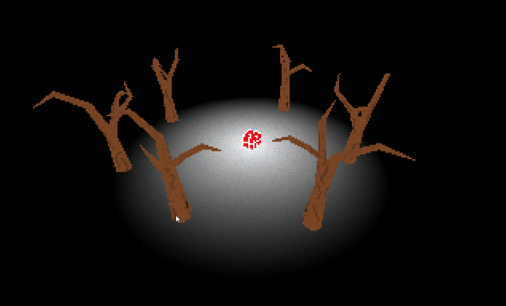

# Software rendering - 0.9



## Build (simplest way)

* Install [vcpkg](https://github.com/microsoft/vcpkg)
* Width vcpkg, install glfw3, glm and glew
 
> On windows
> ```
> vcpkg install glfw3:x64-windows glm:x64-windows glew:x64-windows
> ```

> On linux
> ```
> vcpkg install glfw3:x64-linux glm:x64-linux glew:x64-linux
> ```

* (if necessary) Install [CMake](https://cmake.org/)
* Configure the project against vcpkg toolchain (`CMAKE_TOOLCHAIN_FILE:FILEPATH={vcpkg root}/scripts/buildsystems/vcpkg.cmake`)
* Then build.